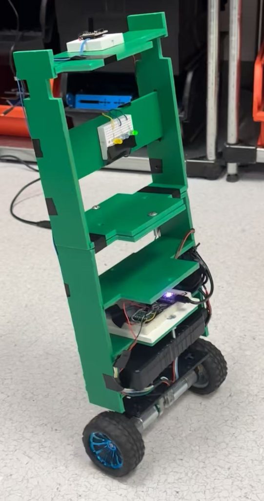
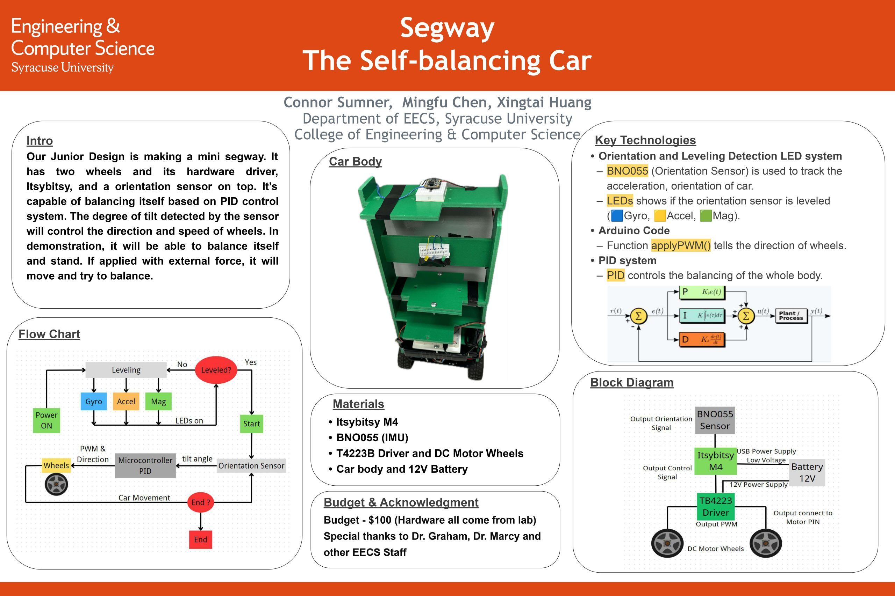
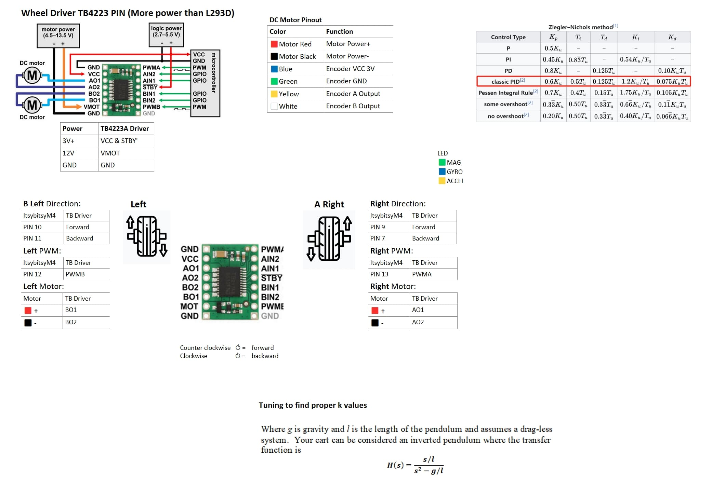

A two-wheel self-balancing robot built for a beginner design course (Jan–May 2024, ELE392 DSP & Control Systems Lab, Syracuse University).  
**Team of 3**. The robot uses an **Adafruit BNO055 IMU** and a **PID closed-loop controller** to keep itself upright and recover from small pushes on a flat floor.

## Demo

[▶️ Watch the Demo](https://github.com/OHXTO/Self-balancing-car/blob/main/assets/demo.mp4)
  
## Open House Posts

## What this project does
- Reads tilt feedback from the BNO055 **gravity vector (X-axis)**.
- Runs a PID controller to compute a motor command.
- Drives **two DC motors** using **PWM (speed)** + **DIR (direction)** signals.
- Logs tilt + motor command over Serial for tuning **PID** parameters and debugging.

## How it works
1. **Sense:** read IMU gravity vector and output `gravX`
2. **Control:** caculate error between `gravX` and a target setpoint (`gxSet`) for input; PID keep `gravX` near the setpoint
3. **Actuate:** apply `PWMvalue` to left/right motors with correct direction
4. **Observe:** print timing + tilt + PWM to Serial Monitor for quick iteration

## 🦾Hardware
- Arduino-compatible board (**ItsyBitsy M4**)
- Adafruit **BNO055** (I2C)
- 2× DC motors + motor driver (H-bridge **TB4223**)
- Battery / power supply
- Leds

## ⌨️Software
- Arduino IDE
- Libraries:
  - `PID_v2.h` (PID controller: PID myPID(...), SetMode, Compute, SetOutputLimits)
  - `Adafruit_BNO055.h` (Read attitude/gravity vector and calibration status)
  - `Adafruit_Sensor.h` (dependency)

## 🔌Wiring

## Running the code
1. Install the libraries above in Arduino IDE.
2. Open `self_balancing_car.ino`.
3. Verify your pin wiring matches the pin definitions in the code.
4. Upload to the board.
5. Open Serial Monitor @ **115200** baud to view logs and calibration info.

## How to tuned balancing

Tuning approach we used:
- Increase `Kp` until the robot reacts fast but begins oscillating
- Add `Kd` to reduce oscillation / overshoot
- Add `Ki` to reduce steady-state drift (if it slowly falls one way)
- Adjust `gxSet` if the balance point is biased (robot balances with a consistent lean)

## Results
- Achieved stable upright balancing on a flat floor
- Recovered from small pushes
- Demonstrated at the department exhibition and received positive feedback

## Team
- Xingtai Huang  [Linkedin](https://www.linkedin.com/in/xingtai-huang/)
- Conner Sumner  [Linkedin](https://www.linkedin.com/in/connor-sumner1/)
- Mingfu Chen    [Linkedin](https://www.linkedin.com/in/mingfuchen02/)

## Associate Teaching Professor
- Jennifer Graham  [Linkedin](https://www.linkedin.com/in/jennifer-graham-436144162/)
